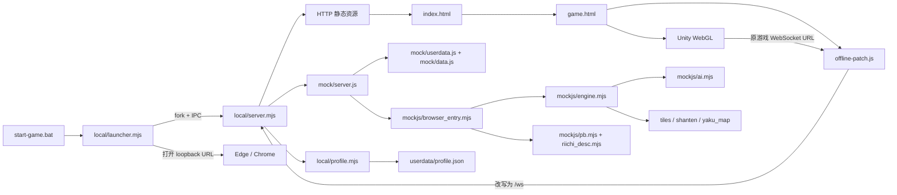
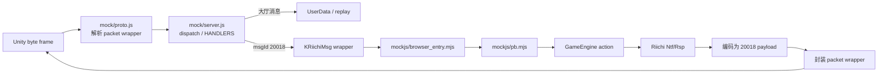
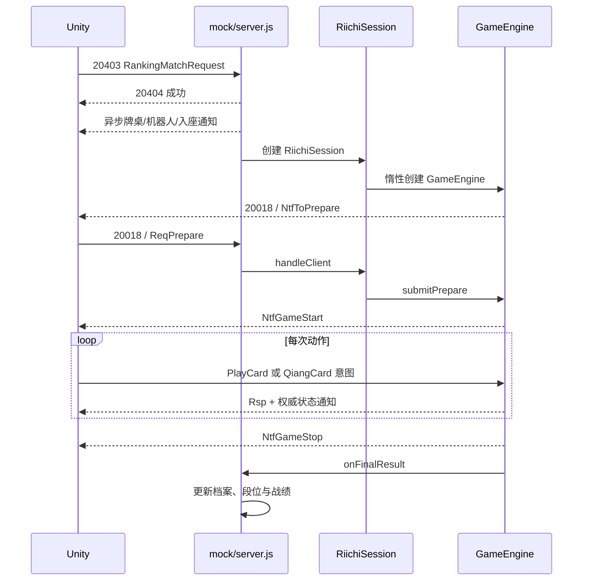

# 《激情麻将 / 雀梦麻将》本地单机版技术与架构说明

> 本文描述当前仓库中的**实际实现**，用于代码、架构和产品边界审查。它不是未来规划，也不把尚未完成的能力描述为已完成。
>
> 文档基线：当前工作区（含尚未提交的本地修复）。最后核对日期：2026-09-10。

## 1. 项目定位

本项目是《激情麻将 / 雀梦麻将》关服前 Unity WebGL 客户端的离线修复版。原 Unity 客户端及美术资源继续负责画面、输入和演出；新增的 Node.js 回环服务替代已关闭的远端服务，负责大厅协议、本地档案、匹配、权威牌局、AI 和结算。

项目目标是：

- 在 Windows 上通过 `start-game.bat` 一键启动；
- 支持四麻、三麻的东风战和半庄；
- 运行时只访问 `127.0.0.1`，不依赖生产服务或互联网；
- 复用原 Unity UI，不重新实现游戏画面；
- 让牌局状态、合法动作和分数结算由本地服务端决定；
- 将昵称、设置、段位、金币和累计战绩持久化到本地文件；
- 保留可维护、可测试的麻将引擎源码，而不是直接修改压缩 bundle。

当前不是一个通用联机麻将服务器，也不提供账号、多用户、远程房间、观战、云存档或跨进程牌局恢复。

## 2. 技术栈与运行要求

| 类别 | 技术 / 版本 | 用途 |
| --- | --- | --- |
| 运行时 | Node.js 22+ | 启动器、本地 HTTP/WS 服务、测试和构建 |
| 模块系统 | 原生 ESM | `local/*.mjs`、`mockjs/*.mjs`、测试 |
| 客户端 | Unity WebGL | 原游戏 UI、交互、动画和音频 |
| HTTP | `node:http` | 本地静态资源服务 |
| WebSocket | `ws` 8.21.3 | Unity 客户端与本地服务之间的二进制协议 |
| Protobuf | `protobufjs` 8.8.0 | 有描述文件的立直麻将内层协议 |
| 线格式兼容 | 自研 schema-less Protobuf | 外层 packet、大厅未知/部分还原消息 |
| 麻将辅助 | `riichi` 1.2.0 | 和牌解析、役种、符数与基础计分 |
| 打包 | esbuild 0.28.2 | 将 `mockjs/` 打包为浏览器兼容 IIFE |
| 测试 | `node:test`、`node:assert/strict` | 单元、集成、回归和固定 seed 自战 |

`package.json` 设置了 `"type": "module"`。旧客户端兼容文件 `mock/*.js` 和 `offline-patch.js` 保持 IIFE 形式，通过 `globalThis.__mj` 共享模块。

## 3. 总体架构



架构分为六层：

1. **启动层**：检查环境、启动子进程、打开浏览器；
2. **本地传输层**：提供静态文件和 `/ws`，限制为回环地址与单活动页面；
3. **客户端兼容层**：拦截外网、模拟原大厅服务、维护 packet wrapper；
4. **协议适配层**：在原外层包与立直麻将内层 Protobuf 之间转换；
5. **领域层**：权威牌局状态机、动作校验、AI、规则与计分；
6. **持久化层**：本地 JSON 档案和原客户端大厅数据快照。

### 3.1 权威边界

- Unity 客户端只提交动作意图，不是牌局真相来源。
- `GameEngine` 持有牌山、手牌、副露、牌河、分数、庄家、场风、本场棒、供托和动作窗口。
- 动作必须与当前下发的 `canPlayActions` / 抢牌窗口匹配，并验证实体牌确实属于相应区域。
- AI 通过引擎提供的自身手牌和公开信息决策，不应读取对手暗牌或未来牌山。
- 档案由 Node 服务持有并落盘；浏览器缓存不是权威存档。

## 4. 启动与关闭链路

### 4.1 Windows 一键启动

`start-game.bat`：

1. 切换到游戏根目录并启用 UTF-8 控制台；
2. 检查 `node` 是否存在；
3. 检查 Node 主版本是否至少为 22；
4. 若 `node_modules/ws/package.json` 不存在，则执行 `npm install`；
5. 把所有命令行参数转发给 `local/launcher.mjs`。

正式模式参数：

```bat
start-game.bat --players=4 --length=east
start-game.bat --players=4 --length=hanchan
start-game.bat --players=3 --length=east
start-game.bat --players=3 --length=hanchan
```

### 4.2 启动器

`local/launcher.mjs` 使用带 IPC 的 `fork()` 启动 `local/server.mjs`。默认给子进程传 `MJ_PORT=0`，由操作系统分配空闲端口。

服务监听成功后通过 IPC 发送 `{ type: 'ready', url }`。启动器把模式参数转换为 URL 查询参数，再按以下优先级打开浏览器：

1. Microsoft Edge；
2. Google Chrome；
3. Windows 默认 URL handler。

启动超过 15 秒、子进程异常、端口问题或浏览器启动失败时会输出中文诊断；浏览器打不开时保留可手动访问的 URL。

### 4.3 关闭行为

关闭启动器或发送 `SIGINT` / `SIGTERM` 时：

- 启动器向服务子进程转发信号；
- 服务等待已有存档写入链完成；
- 再序列化最新大厅数据并做最后一次原子保存；
- 关闭 HTTP 和 WebSocket server。

直接关闭游戏页面但不停止服务时，正在进行的比赛由 AI 接管真人席，并把速度设为 0 快速打完；比赛结果仍会进入本地档案。

## 5. HTTP 静态资源服务

`local/server.mjs` 同时是静态文件服务器。它只监听：

```text
127.0.0.1:<MJ_PORT，默认 8765；启动器默认使用随机空闲端口>
```

主要行为：

- `/` 映射到 `/index.html`；
- 仅接受 `GET` 和 `HEAD`；
- 对 URL 解码后执行 `path.resolve`，拒绝逃逸项目根目录的路径；
- 为 HTML、JS、CSS、JSON、WASM、图片、音频、bundle 和 `.unityweb` 设置 MIME；
- `Build/*.unityweb` 带 `Content-Encoding: br`；
- 支持普通、前缀和后缀 byte Range；非法或越界 Range 返回 416；
- `HEAD` 返回与 GET 一致的头但不发送 body；
- HTML/JS 使用 `no-cache`，其余资源使用一小时缓存；
- 设置 `X-Content-Type-Options: nosniff`。

启动前必须找到：

- `index.html`
- `game.html`
- `Build/mj-h5.loader.js`

缺失时服务会停止并提示重新解压完整游戏目录。

## 6. Unity WebGL 客户端与离线补丁

### 6.1 页面结构

- `index.html` 是外层页面，以 iframe 加载 `game.html`，转发查询串并处理横竖屏；
- `game.html` 创建 Unity canvas，先加载离线补丁，再加载 Unity loader；
- `game.html` 中的 Unity 配置指向 `Build/` 和 `StreamingAssets/`；
- `QuickSDK`、`H5SDK`、`QuickService` 被本地 stub，避免原渠道 SDK 缺失导致初始化崩溃。

当前中文构建产品版本为 `1.1.107241726.0`。`Build_intl/` 是国际版资源，不属于当前中文客户端的主要验收范围。

### 6.2 `offline-patch.js`

补丁必须在 Unity 初始化前加载。它负责：

- 将包含 `riichiproxy`、`mahjongproxy` 或 `riichi_proxy` 的游戏 WS 地址改写到同源 `/ws`；
- 拒绝其他跨源 WebSocket；
- 对外部 `fetch` 返回空 JSON 响应；
- 把外部 XHR 改写到 `/mock/empty.json`；
- 将远端 `StreamingAssets` URL 改写成本地同路径；
- 阻止动态外部 `<script>`；
- 修复原 WebGL helper 在 URL 不含 `?` 时的参数解析崩溃；
- 在 `window.__mjmock` 中保留最多 200 条 WS 收发长度诊断，不记录完整牌局 payload。

这层是运行时离线边界。项目不应重新接入生产域名、远端日志或远端 WSS。

## 7. WebSocket、会话与连接模型

### 7.1 连接入口

HTTP upgrade 只接受 `/ws`。`ws` 的 `maxPayload` 为 2 MiB。

服务只允许一个活动 WebSocket。第二个页面连接时收到 HTTP 409，防止两个 Unity 页面同时驱动同一个本地档案和牌局会话。

### 7.2 唯一 Session

`local/server.mjs` 启动时创建唯一 `mock.server.Session`，并在断线重连时复用。Session 主要状态包括：

- 登录标志、uid、session UUID、请求序号和下行计数器；
- `tableId`、座位和牌桌成员快照；
- 匹配计时器、引擎启动计时器和防旧任务误触发的 token；
- 当前 `RiichiSession`；
- 本局已下发的牌局通知帧，用于断线后重放。

连接断开时：

- 尚在匹配且引擎未创建：取消全部计时器并清空牌桌；
- 对局进行中：保留引擎，切换真人为 AI 托管；
- 重连后：先暂停实时下推，等待客户端发 20162，再重放本局事件并恢复实时流。

当前重连本质上是**当前进程内的事件回放**，不是可跨进程、可从任意局面恢复的完整状态快照。服务重启后不会恢复未完成比赛。

## 8. 协议架构

协议分为外层 packet 和内层立直麻将消息。



### 8.1 外层 packet

`mock/proto.js` 是无 schema 的 Protobuf wire-format 工具。解析结果表示为：

```text
[[fieldNumber, wireType, value], ...]
```

它处理 varint、fixed64、bytes 和 fixed32，并对 int64/fixed64 使用 BigInt 或安全数字转换，避免 32 位位运算截断。

`mock/server.js` 中使用的外层主要字段：

| 字段 | 含义 |
| --- | --- |
| f1 | packet type：1 响应，2 请求 / KeepAlive |
| f2 | msg_id |
| f3 | 业务 payload |
| f6 | KeepAlive 回包辅助字段 |
| f7 | 服务端 uid |
| f8 | 固定值 1 |
| f11 | RPC 请求 seq；仅响应回显，主动通知不写 |
| f12 | 客户端固定值 4001 |
| f24 | UserData 增量变更 |
| f27 | 服务端下行计数器；异步通知实际发送时才分配，避免被即时响应超车后倒序 |
| f29 | 客户端版本号 |

通常响应 `msg_id = 请求 msg_id + 1`；KeepAlive 20019 原 id 返回。未知请求不伪装成功，而是返回失败结果并写入最大 200 条的 `LOG.unhandled`。

### 8.2 大厅协议兼容层

`mock/server.js` 注册 `HANDLERS`，主要覆盖：

- 20001：登录；
- 20019：KeepAlive；
- 100141：查询用户数据；
- 100903：任务客户端事件；
- 100003、100007、100011、100151、100204：设置、昵称和装备等大厅写操作；
- 100620：签到；
- 20007、20009、20012：牌桌列表、入桌和入座；
- 20403、20405：段位匹配和取消匹配；
- 20162：离线转在线恢复；
- 20018：立直麻将逻辑数据；
- 20025、20102：离桌和对局收尾。

其中部分静态响应来自 `mock/data.js` 的真实快照回放；可变大厅模块由 `mock/userdata.js` 解析、修改并通过外层 f24 增量推送，符合原客户端“等待服务端 DataChange 才提交 UI”的行为。

### 8.3 立直麻将内层协议

`mockjs/riichi_desc.mjs` 保存由原协议还原的描述对象，`mockjs/pb.mjs` 用 `protobufjs/light.js` 构建类型并编码/解码。

`mockjs/browser_entry.mjs` 的 `RiichiSession` 是协议与领域引擎之间的适配器：

- 收到 Prepare、出牌、自摸/杠/拔北、抢牌、设置等请求；
- 解码 payload 后调用 `GameEngine.submit*`；
- 把动作结果编码为 `Rsp*`；
- 把引擎事件编码为 `Ntf*`；
- 保证一场比赛结束后不在同一个 `RiichiSession` 偷偷重建引擎。

主要内层消息：

- 请求/响应：Prepare、PlayCard、QiangCard、SetInternalState、CloseOfflineTip、ClickUI；
- 通知：ToPrepare、Prepare、GameStart、SendCard、PlayCard、QiangCard、QiangCardEnd、GameStop、OfflineTip。

协议枚举集中在 `mockjs/proto_enum.mjs`。协议字段名、消息名和枚举值属于兼容契约，不应随意重命名。

## 9. 匹配和开局流程

典型流程：



若 URL 显式提供人数或长度，它优先于原模式页面发来的 gameType。否则 `20403` 会根据客户端模式请求决定三/四麻及东风/半庄。

匹配采用两级异步任务：匹配完成和引擎启动。两级 timer 都保存在 Session 中并受 `matchToken` 保护；取消、离桌、收尾或断线都会清除它们，避免取消后“幽灵开局”。

## 10. 权威麻将引擎

`mockjs/engine.mjs` 的 `GameEngine` 是核心状态机。构造配置包括：

- `players`：3 或 4；
- `akaCount`：赤宝数量配置；
- `startScore`：默认四麻 25000、三麻 35000；
- `matchLength`：`east` 或 `hanchan`；
- `maxHands`：防异常无限比赛的上限；
- `seed`：显式可复现随机种子；
- `speed`：演出/AI 延迟倍率，0 为立即执行；
- `baseTime`、`extraTime`：真人动作时间；
- `internalState`：客户端自动和牌等设置；
- `uids`：座位到客户端 uid 的映射；
- `autoHuman`：测试或断线托管模式。

`RiichiSession.opts.internalState` 保留历史设置供存档兼容；运行中的自动操作只接受当前客户端实际提交的 `clientInternalState`。开局协议没有自动操作设置字段，不能把存档中的“不鸣”等开关直接激活，否则界面显示可鸣牌，后端却立即自动过。新会话和更换连接时清除旧自动操作授权，不修改历史档案；客户端明确提交的开关仍正常生效。

真人每次出牌或鸣牌决策有基础 5 秒，超出部分才扣本小局共用的 20 秒备用时间；只有下一小局补满。切换自动操作或重连不补时。取消不鸣时，尚未执行的自动过牌微任务必须重新检查当前设置，并继续等待原截止时间。

### 10.1 状态

比赛级状态：

- 人数与三麻标志；
- 当前场风、局号、庄家；
- 本场棒、立直棒；
- 各家分数；
- 比赛长度、终局条件和安全手数上限；
- 累计比赛统计；
- 固定 seed RNG。

单局状态：

- 活牌山、王牌、岭上牌；
- 宝牌与里宝牌指示牌；
- 各家实体手牌、副露、牌河；
- 立直、双立直、一发、门清、振听、包牌等标记；
- 当前摸牌者、最后舍牌、巡目和剩余牌；
- 唯一的摸牌动作窗口或抢牌动作窗口；
- 待翻杠宝、杠次数及本局是否结束。

### 10.2 实体牌模型

`mockjs/tiles.mjs` 使用实体 tile ID，而不是只用“牌种字符串”。ID 可以区分同种牌的四个副本和赤五，因此能正确验证：

- 提交的牌是否真的在手牌中；
- 杠是否提交了实际四张牌；
- 鸣牌后哪张牌进入副露；
- 赤宝和普通五的差异；
- 牌山中牌的唯一归属。

`buildWall()` 生成牌山和赤牌集合。三麻移除二万至八万，保留北风；四麻王牌 14 张，三麻为支持拔北岭上扩展为 18 张。

### 10.3 动作状态机

引擎只接受当前期待窗口中的动作：

- 摸牌方窗口：普通弃牌、立直、暗杠、加杠、自摸、九种九牌、拔北；
- 舍牌后窗口：过、吃、碰、明杠、荣和；
- 抢杠/抢北窗口：按规则限定可和者。

`validateTurnPayload()` 和 `validateClaimPayload()` 先验证动作类型、实体牌、禁止舍牌、立直约束和附带牌，再提交状态变更。非法动作返回 `Result` 错误码，不应改变牌河、手牌、副露或等待状态。

抢杠/抢北在宣告与询问阶段保留原手牌；`winRons()` 确认所有赢家合法后才移除宣告的实体牌，多响只移除一次，不升级副露或增加杠数。普通荣和不再移除放铳者暗手；立直宣告回滚也必须在和牌校验后提交。

真人超时会自动摸切或跳过鸣牌；断线后引擎把真人席视为 AI。同步重复包由 `_processing` 和 expected-window 状态防止重放。

### 10.4 已覆盖的规则重点

当前实现和测试包含：

- 三麻牌池、拔北和岭上牌；
- 吃、碰、明杠、暗杠、加杠及食替限制；
- 立直、双立直、一发、立直后暗杠等待不变约束；
- 同巡振听和立直后永久振听；
- 抢加杠、国士抢暗杠、抢北；
- 多家和牌与供托归属；
- 流局、听牌/未听罚符、流局满贯；
- 九种九牌、四风连打、四杠、四家立直等途中流局；
- 包牌责任；
- 东风战南入、半庄推进、延长赛、和了止和必要点；
- 终局顺位与点棒结算。

规则争议以 `docs/adr/0002-use-mahjong-soul-ranked-rules.md` 指定的雀魂段位战规则为唯一基线。

## 11. 向听、AI 与计分

### 11.1 向听模块

`mockjs/shanten.mjs` 把实体牌转换为 34 种计数，计算：

- 普通四面子一雀头向听；
- 七对子向听；
- 国士无双向听；
- 等待牌；
- 各候选弃牌后的向听和受入。

三麻牌种限制由调用方保持一致，避免把不存在的二万至八万计入受入。

### 11.2 AI

`mockjs/ai.mjs` 负责牌型转换、和牌检测、弃牌候选和二级评分。当前 AI 会考虑：

- 向听数和有效牌数量；
- 宝牌、赤宝、牌形价值；
- 食替禁止牌；
- 现物、筋、壁和公开信息推导的危险度；
- 无役副露拒绝和役牌碰；
- 部分 All Last 顺位、领先防守和立直/默听选择。

开门路线评估只使用 `realMelds()` 和扣除拟鸣牌用牌后的暗手：拔北不参与面子/幺九判断，拟碰的对子不能同时算作暗手对子和副露。该检查仍是启发式，不保证未来一定成役。

固定 seed 下，牌山、机器人外观、牌桌标识和 AI 决策链可复现。现有测试要求单次 AI 决策远低于 2 秒。

需要明确：当前 AI 是启发式策略，不是完整策略搜索器。统一候选效用、深入押引、复杂顺位目标和有限前瞻搜索仍在 `docs/repair-backlog.md` 中列为后续增强。

### 11.3 计分

`mockjs/ai.mjs` 将手牌、副露、场风、座风、立直、一发、岭上、海底/河底、抢杠、天地和等上下文转换为 `riichi` 包所需格式。`mockjs/yaku_map.mjs` 再把库返回的役种映射成原客户端 `YiType` / `ManType`。

`riichi` 1.2.0 不识别拔北副露：`calcWin()` 对单次计算实例的 `calcYaku()` 做局部适配，在无役过滤、宝牌/符/点数计算前补一次拔北岭上，不污染其他实例或役满。暗杠的两张代表牌必须保留红牌。升级依赖时必须复跑 `test/scoring-regression.test.mjs`。

引擎负责库外的比赛结算逻辑，包括：

- 自摸/荣和支付；
- 本场棒和立直供托；
- 多响；
- 包牌；
- 流局罚符和流局满贯；
- 终局排序、顺位点与档案回写。

本场与轮庄独立更新：荒牌即使轮庄也增加本场，和牌轮庄才清零；个人最大连庄由独立 `renchanCount` 累计。途中流局不触发听牌止，延长场多响含庄优先连庄。包牌本场全部由责任者承担；复合役满的非包部分仍正常支付。具体依据和未覆盖边界见 [`backend-audit.md`](backend-audit.md)。

## 12. 本地档案

### 12.1 所有权和位置

依据 `docs/adr/0001-filesystem-owned-local-save.md`，档案默认位于：

```text
userdata/profile.json
```

可通过 `MJ_USERDATA_DIR` 指向其他目录，测试和调试应使用临时目录，避免污染正式存档。

选择游戏目录而不是浏览器存储或 `%LOCALAPPDATA%`，是为了让离线包可见、可移动，且不因清除浏览器站点数据而丢失。

### 12.2 Schema

当前 `PROFILE_VERSION = 1`，顶层结构：

```json
{
  "version": 1,
  "nickname": "离线玩家",
  "coins": 999999,
  "ranks": {
    "yonma": { "level": 17, "point": 2300 },
    "sanma": { "level": 17, "point": 2300 }
  },
  "stats": {
    "yonma": { "players": 4, "games": 0, "byLength": {} },
    "sanma": { "players": 3, "games": 0, "byLength": {} }
  },
  "settings": {
    "internalState": { "0": true, "1": false, "2": false, "3": false, "4": false, "5": false }
  },
  "lobbyData": null
}
```

真实 `stats` 还包含：小局数、顺位次数、和牌、放铳、立直、副露、自摸、荣和、和牌点数、和牌巡目、击飞、最大连庄，并分别按东风/半庄累计。

`lobbyData` 是 `mock/userdata.js` 当前大厅模块的 base64 序列化结果，用于保留原 UI 的装备、内容选择和其他兼容数据。

`local/economy.mjs` 在首次启动时对新/旧档案执行一次补给，新增 `offlineEconomyVersion: 1`。雀币60001以当时背包余额×100；60002/60008/60009/60010/60011/60012各置999999，三四麻均为七段2300 PT。补给、段位和大厅快照一起落盘后才监听端口；以后不再覆盖消费或升降段结果。见 ADR 0003。

### 12.3 读写保证

`local/profile.mjs`：

- 读取时把缺失字段与当前默认结构合并；
- 强制规范化为当前版本，兼容旧档案缺字段；
- 不存在时创建默认内存档案；
- JSON 损坏时把原文件改名为 `profile.corrupt-<timestamp>.json`，再回退默认档案；
- 保存时先写唯一临时文件，再 rename 为 `profile.json`；
- 原子替换遇到 `EPERM/EACCES/EBUSY` 时等待10/20ms，最多三次尝试；绝不先删除旧档案；
- 写入失败会清理临时文件并向上抛错；
- 服务层以 Promise chain 串行保存，避免旧写入覆盖新状态。

只有完成的整场比赛写入累计战绩；未结束比赛和单场牌谱不会偷偷进入档案。

### 12.4 段位和奖励

三麻、四麻段位独立。`recordMatch()` 按真人 0 号位的最终名次更新：

- 分模式、分东风/半庄统计；
- 对应段位 PT 和升降段；
- 每场固定增加 100 本地金币；
- 原客户端 ProfileInfo 显示字段。

段位门槛及分房间 PT 直接使用 `mockjs/economy_catalog.mjs` 中的原 `Rank2*` 配置。初始 PT 不是降段下限；七段升段需4600 PT，负 PT 时按原表回退。匹配请求的房间ID经 Session 传入 `recordMatch()`，未指定时使用该段默认房间。用户确认保留原房间上限，因此七段开放乘风/御龙，不开放低级的启航/逐梦。

### 12.5 四类离线商店

- `mockjs/shop.mjs` 处理商品、价格、余额、限购、发货和刷新；`mock/server.js` 负责100500/100501购买、100502/100503刷新及wrapper f24增量。
- 服务端 `ShopType`：招募1、杂货2、雀币5、荣耀7。不要使用界面标签枚举（招募3、杂货4、雀币2、荣耀5）。请求 f2为商品ID、f3为数量、f4固定1；当前空档位配置只接受f7=0。
- 原配置由 `python tools/extract_economy_config.py` 只读提取，开发机需UnityPy/Brotli；运行游戏只读取生成的ESM目录，无Python或网络依赖，不改Unity产物。
- 雀币每日按原8槽位/稀有度/单价生成；每天一次免费刷新，然后按原价格梯级扣费。杂货限购按日、荣耀按月（UTC+8）重置。
- `UserData.changeInventory()` 先整体校验，再提交扣款和堆叠物品增量；唯一角色/装扮已拥有则不重复扣款，旧档案缺失时使用相同物品的离线模板补齐。
- 同连接最近64条购物RPC重试可复用响应，避免重复扣费；更换连接清除缓存，跨连接不承诺订单幂等。
- 库存/限购数据随 `lobbyData` 原子保存；普通请求沿用50ms合并保存，不能把响应成功视为断电前已同步写盘。真实WS回归验证四商店消费落盘并重启后不补满。
- 不接入充值、抽卡或模组商店。`profile.coins`仍是单独的本地结算累计，不作为商店付款余额。

## 13. 随机性与复现

`mjSeed` 或 `mock.config.seed` 被规范化为无符号 32 位整数。随机算法为 Mulberry32。

同一个 seed 用于：

- 匹配生成的牌桌 / game 标识；
- AI 对手外观；
- 权威牌山洗牌；
- 引擎中依赖 RNG 的后续行为。

未指定 seed 时优先使用 Web Crypto 生成随机 seed，并把 seed 记录到牌桌和日志。调试链接示例：

```text
http://127.0.0.1:<port>/?mjPlayers=3&mjLength=hanchan&mjSeed=123456&mjSpeed=0
```

参数说明：

| 参数 | 值 | 作用 |
| --- | --- | --- |
| `mjPlayers` | `3` / `4` | 人数 |
| `mjLength` | `east` / `hanchan` | 东风 / 半庄 |
| `mjSeed` | 整数 | 固定随机种子 |
| `mjSpeed` | 数字 | AI/演出延迟倍率；0 最快 |
| `mjAka` | 整数 | 赤牌配置（兼容层支持） |
| `mjAutoHuman` | `0` / 非 0 | 测试用真人自动托管 |
| `mjMatchDelay` | 毫秒 | 测试/调试匹配延迟 |

正常用户入口只公开人数和比赛长度；其余属于调试能力。

## 14. 构建与生成物

可维护源码在 `mockjs/`。执行：

```bash
npm run build
```

实际运行 `node mockjs/build_browser.mjs`，由 esbuild：

- 入口：`mockjs/browser_entry.mjs`；
- 输出：`mock/riichi.js`；
- 平台：browser；
- 格式：IIFE；
- target：ES2020。

`mock/riichi.js` 是自动生成文件，不应手改。修改任意 `mockjs/*.mjs` 后必须重新构建，并把源码与生成物一起审查。

`mock/data.js` 也是自动生成的真实大厅快照/回放数据；其注释标明原生成工具，但当前仓库中没有完整工具链，因此不应为普通修复直接手工重写。

Unity 的 `Build/`、`Build_intl/`、`StreamingAssets/` 是不可维护的原始构建资源，不属于 JS 构建流程。

## 15. 测试与质量门禁

标准命令：

```bash
npm run build
npm run check
npm test
```

- `build`：重建浏览器麻将 bundle；
- `check`：对兼容层、服务和引擎源码执行 `node --check`；
- `test`：运行 Node 内置测试。

当前测试文件职责：

| 文件 | 主要覆盖 |
| --- | --- |
| `test/action-validation.test.mjs` | 非法动作不变性、实体杠牌、食替、振听、抢杠/抢北、超时和断线托管 |
| `test/ai-strategy.test.mjs` | 防守风险、无役副露、All Last 默听、确定性与预算、隐藏字段读取隔离 |
| `test/build-smoke.test.mjs` | 内层 Protobuf 往返、浏览器 bundle 全局导出契约 |
| `test/engine-smoke.test.mjs` | 固定 seed、四模式终局守恒、三麻牌池、计分上下文 |
| `test/local-service.test.mjs` | 档案原子写入/损坏恢复、段位、HTTP/Range/HEAD、WS 和单页面限制 |
| `test/match-progression.test.mjs` | 南入、半庄推进、和了止、延长赛和必要点 |
| `test/match-routing.test.mjs` | 模式路由、未知请求失败、seed、取消匹配竞态 |
| `test/proto-wire.test.mjs` | int64/fixed64 和标量字段替换 |
| `test/scoring.test.mjs` | 多响、供托、本场、流局满贯、包牌、顺位和客户端结算字段 |
| `test/userdata-profile.test.mjs` | 分模式战绩写回原客户端 ProfileInfo |
| `test/ai-action-legality.test.mjs` | AI 明杠/立直拔北实体牌、筋食替、合法弃牌向听与受入 |
| `test/autoplay-race.test.mjs` | 动画等待中托管/重连、早到输入、过和与重复赢家竞态 |
| `test/draw-progression-regression.test.mjs` | 流局本场、途中流局终局边界、延长场多响、个人连庄 |
| `test/scoring-regression.test.mjs` | 拔北岭上、暗杠红宝、包牌本场及混合役满支付 |
| `test/engine-invariants.test.mjs` | 四模式 × 5 种子自战，通知边界实体牌、余牌、点棒及窗口不变量 |
| `test/claim-boundaries.test.mjs` | 吃后无合法弃牌、吃碰替代荣和的振听、自持四张形式听牌 |
| `test/transport-order.test.mjs` | 异步通知与即时心跳交错时的下行序号、RPC 序号和旧连接隔离 |
| `test/claim-timing.test.mjs` | 鸣牌基础 5 秒、共享延长时间、到期前碰牌与计时器清理 |
| `test/claim-session-regression.test.mjs` | 历史自动操作隔离、真实吃/碰/明杠协议链路、共享备用时间、三麻禁吃、取消不鸣与重连授权 |
| `test/ai-open-yaku-regression.test.mjs` | 拔北不参与面子/幺九判断、拟碰对子去重、拒绝无役开门 |
| `test/robbed-tile-regression.test.mjs` | 抢杠/抢北结算实体牌移除、多响、普通荣和隔离及失败不变性 |

固定 seed 自战用于验证四种模式都能终局且点棒加未领取供托守恒。自动测试不能替代 Unity 浏览器端的演出、按钮、音频和资源完整性手测。

当前没有 ESLint/Biome 或格式化器；代码审查需按既有风格控制无关 diff。

## 16. 目录与关键文件索引

### 16.1 根目录

| 路径 | 类型 | 职责 / 审查重点 |
| --- | --- | --- |
| `README.md` | 手写 | 用户启动和最小开发说明 |
| `AGENTS.md` | 手写 | AI/协作者开发规范，不是运行时文件 |
| `CONTEXT.md` | 手写 | 产品目标、验收边界和已确认决策 |
| `start-game.bat` | 手写 | Windows 环境检查和一键入口 |
| `index.html` | 原页面+小补丁 | iframe、方向和顶层页面边界 |
| `game.html` | 原页面+本地补丁 | Unity 加载、渠道 SDK stub、错误提示 |
| `offline-patch.js` | 手写兼容层 | 网络隔离、WS 改写、资源 URL 和诊断 |
| `spark-md5.js` | 第三方/原资源 | Unity 资源校验相关辅助脚本 |
| `.nojekyll` | 静态托管遗留 | 防 Jekyll 处理；本地服务不依赖它 |
| `.gitignore` | 手写 | 忽略依赖、存档和 `.tmp-*` 调试产物 |

### 16.2 Unity 与资源

| 路径 | 大小约 | 说明 |
| --- | ---: | --- |
| `Build/` | 20 MiB | 中文 Unity WebGL loader、data、framework、WASM、symbols |
| `Build_intl/` | 20 MiB | 国际版 Unity WebGL 构建，不是当前主要目标 |
| `StreamingAssets/` | 253 MiB / 496 文件 | 运行时 bundle、版本表和美术/音频资源 |
| `TemplateData/` | 212 KiB | Unity 页面样式、图标和加载条图片 |

这些文件大多是二进制或压缩构建产物。除非有明确资源替换方案，不应直接修改。

### 16.3 Node 本地服务

| 路径 | 职责 |
| --- | --- |
| `local/launcher.mjs` | 子进程、IPC、模式参数、浏览器定位与启动诊断 |
| `local/server.mjs` | 静态 HTTP、Range/HEAD、loopback WS、唯一连接、Session/档案接线、退出保存 |
| `local/profile.mjs` | profile 默认值、迁移/规范化、段位、统计、损坏恢复和原子写入 |

### 16.4 客户端兼容层

| 路径 | 来源/职责 |
| --- | --- |
| `mock/proto.js` | 无 schema 外层 Protobuf wire 工具 |
| `mock/data.js` | 自动生成的大厅初始数据与录制响应 |
| `mock/userdata.js` | 大厅模块模型、增量修改、序列化和 ProfileInfo 适配 |
| `mock/server.js` | 大厅协议 handler、Session、匹配、牌桌、重连和对局桥接 |
| `mock/riichi.js` | 从 `mockjs/` 自动生成的浏览器 bundle |
| `mock/empty.json` | 被拦截外部 XHR 的本地空响应 |

### 16.5 可维护麻将源码

| 路径 | 职责 |
| --- | --- |
| `mockjs/engine.mjs` | 权威状态机、规则、动作验证、计分和比赛推进 |
| `mockjs/ai.mjs` | 手牌格式、和牌辅助、牌效、弃牌与防守评分 |
| `mockjs/tiles.mjs` | 实体牌 ID、牌山、赤牌、三麻牌池、宝牌循环 |
| `mockjs/shanten.mjs` | 普通形/七对子/国士向听、等待和受入 |
| `mockjs/yaku_map.mjs` | `riichi` 结果到客户端役种/满贯类型映射 |
| `mockjs/proto_enum.mjs` | 结果码、消息、动作、役种和流局枚举 |
| `mockjs/riichi_desc.mjs` | 内层 Protobuf 描述 |
| `mockjs/pb.mjs` | 描述驱动的内层编码/解码 |
| `mockjs/browser_entry.mjs` | `RiichiSession` 适配器和浏览器全局导出 |
| `mockjs/build_browser.mjs` | esbuild 构建脚本 |

### 16.6 文档与测试

| 路径 | 职责 |
| --- | --- |
| `docs/adr/0001-filesystem-owned-local-save.md` | 档案所有权决策 |
| `docs/adr/0002-use-mahjong-soul-ranked-rules.md` | 唯一规则基线决策 |
| `docs/repair-backlog.md` | 已完成、未完成与验收清单 |
| `docs/technical-architecture.md` | 本文，当前技术全景 |
| `test/*.test.mjs` | 自动回归测试 |

### 16.7 不应纳入源码审查/提交的本地产物

- `node_modules/`：npm 安装结果；
- `userdata/`：个人运行时档案；
- `.tmp-*`：截图、解压资源和调试脚本；
- 临时测试目录或本地浏览器数据。

## 17. 环境变量和调试接口

| 名称 | 默认 | 用途 |
| --- | --- | --- |
| `MJ_PORT` | 服务直接运行时 8765；启动器传 0 | 指定监听端口 |
| `MJ_USERDATA_DIR` | `<root>/userdata` | 隔离档案目录 |
| `MJ_DEBUG` | 非 1 | 设为 1 开启兼容层详细日志 |

Git Bash 示例：

```bash
MJ_DEBUG=1 MJ_PORT=8765 MJ_USERDATA_DIR=.tmp-profile npm start
```

浏览器控制台诊断：

- `window.__mjmock.stats`：WS 收发计数；
- `window.__mjmock.dump(n)`：最近 n 条帧长度与方向；
- Node/兼容环境中的 `__mj.server.unhandled()`：按 msgId 汇总被拒绝的未知请求；
- `__mj.server.config`：当前模式和调试配置。

诊断接口不应暴露对手暗牌或未来牌山。

## 18. 安全、可靠性与兼容性边界

### 已有保证

- HTTP/WS 只绑定 `127.0.0.1`；
- 拒绝路径穿越和非 GET/HEAD 静态请求；
- WS 限制 2 MiB，并拒绝第二活动页面；
- 浏览器补丁拦截外网通信；
- 未知协议请求明确失败，不以空成功掩盖缺失功能；
- 存档原子替换、写入串行、损坏文件备份；
- 引擎在状态变更前验证动作；
- 固定 seed 可复现并有终局/点棒守恒测试。

### 明确限制

- 没有身份认证：安全模型依赖服务仅监听本机；
- 静态服务可以读取项目根目录内任意已知文件路径，不是面向不可信网络的通用文件服务器；
- 单进程、单档案、单活动页面；
- 重连不跨服务进程；
- 没有完整牌谱持久化和任意局面快照；
- 原 Unity 二进制不可维护，UI 逻辑只能通过兼容层和协议适配；
- 原协议并未全部还原，当前实现以实际本地流程所需消息为范围；
- AI 尚未达到完整策略搜索水平；
- 国际版资源不是当前完成标准。

因此不要把服务绑定到 `0.0.0.0` 或直接暴露到局域网/公网，也不要把浏览器传来的非权威数据直接写进引擎状态。

## 19. 修改原则与依赖方向

推荐依赖方向：

```text
local/server.mjs
  -> local/profile.mjs
  -> mock/*.js compatibility
  -> mockjs/browser_entry.mjs
       -> engine.mjs
          -> tiles.mjs / shanten.mjs / ai.mjs / yaku_map.mjs
       -> pb.mjs / proto enums
```

修改规则：

1. 规则和引擎改动优先落在 `mockjs/`；
2. 修改 `mockjs/` 后运行 `npm run build`，不要手改 `mock/riichi.js`；
3. 外层消息或大厅行为改动同时检查 `mock/proto.js`、`mock/userdata.js`、`mock/server.js`；
4. 内层协议改动同时检查描述、编解码、调用方和测试；
5. 动作先验证、后修改状态，并补非法输入不变性测试；
6. 存档 schema 变更必须提高版本并提供兼容规范化/迁移；
7. 不为修复 JS 逻辑而重写 Unity 页面或二进制资源；
8. 不新增联网依赖或生产地址；
9. 不让 AI 读取不可见信息；
10. 提交前执行 build、check 和 test。

## 20. 当前技术债与后续审查重点

以下事项在当前架构中仍需重点审查或增强：

1. **逐动作全局不变量**：现有测试覆盖多个非法动作和终局守恒，但尚未在每个动作后系统检查所有实体牌唯一归属、唯一动作窗口和全部分数/供托不变量；
2. **重连快照**：当前依赖本局事件缓存重放，长局内存增长、事件完整性和中途版本兼容值得继续验证；
3. **AI 深度**：牌效、防守和部分顺位策略已经存在，但还没有统一效用模型和有限搜索；
4. **协议覆盖率**：未知消息会正确失败，但原客户端非核心页面仍可能触发未实现接口；
5. **Unity 外围入口**：部分原线上入口可能仍可点击，理想状态应明确提示“离线不可用”；
6. **档案迁移策略**：版本 1 只有规范化，没有多版本迁移链；未来 schema 变化必须先设计迁移；
7. **浏览器 E2E**：Node 测试覆盖逻辑，但 Edge/Chrome 中完整资源、动画、音频、断线和长时间运行仍需人工验收；
8. **生成数据来源**：`mock/data.js` 标注了生成工具，但仓库未包含完整可复现生成链，后续若需更新快照应先补工具或 ADR；
9. **静态文件暴露面**：loopback 假设下可接受，但若未来改变监听范围，必须先增加允许列表、鉴权和更严格响应头；
10. **工作区治理**：离线恢复与首轮审查已通过 `64dcc3e` 入库；后续修复应继续按规则、服务及对应测试拆分可解释提交。

完整功能状态和验收项以 `docs/repair-backlog.md` 为准；本文用于解释系统如何工作，不替代 backlog。

## 21. 建议的审查顺序

为了减少跨层跳转，建议按以下顺序审查：

1. `CONTEXT.md`、两个 ADR：确认产品与规则边界；
2. `start-game.bat`、`local/launcher.mjs`：确认进程和启动模型；
3. `local/server.mjs`、`local/profile.mjs`：确认网络、会话和存档所有权；
4. `offline-patch.js`、`index.html`、`game.html`：确认离线边界和 Unity 接线；
5. `mock/proto.js`、`mock/userdata.js`、`mock/server.js`：确认原协议兼容层；
6. `mockjs/browser_entry.mjs`、`pb.mjs`、协议描述和枚举：确认内层适配；
7. `tiles.mjs`、`shanten.mjs`、`ai.mjs`、`yaku_map.mjs`：确认领域辅助；
8. `engine.mjs`：按牌局生命周期、动作窗口、计分、终局四段审查；
9. `test/*.test.mjs`：反向确认每项关键行为有回归保护；
10. `docs/repair-backlog.md`：确认尚未完成的能力没有被误判为完成。

审查引擎时尤其关注三个问题：客户端能否伪造实体牌、非法动作是否会部分修改状态、任何异步 timer/重复包是否能越过当前动作窗口。这三类问题是当前架构中风险最高的正确性边界。

## 22. 四川血战（5022）后端

日麻运行链路不变。`mockjs/sichuan_table.mjs` 组合会话、下行投影、上行裁决与 RPC 去重，经 `browser_entry.mjs` 导出为 `__mj.sichuan`；`mock/server.js` 的 `startSichuanMatch()` 负责组桌、帧缓存/重放和雀币记账，`local/server.mjs` 断线时调用 `detachMatch()` 让 AI 接管。原 Unity 四川页面尚未人工验收。

| 层 | 文件 | 职责 |
| --- | --- | --- |
| 原规则与协议 | `sichuan_catalog.mjs`、`majiang_desc.mjs`、`majiang_pb.mjs` | 只读提取的原页面规则、独立地方麻将schema与严格编解码 |
| 牌形/计分 | `sichuan_hand.mjs`、`sichuan_score.mjs` | 实体牌校验、合法和牌、番型择优及纯积分支付 |
| 策略 | `sichuan_ai.mjs` | 仅从本人暗牌及公开信息选择换牌、定缺和合法动作 |
| 权威局序 | `sichuan_engine.mjs`、`sichuan_settlement.mjs` | 血战单局、多响/抢补杠/已胡退出、荒牌退税/查叫/花猪 |
| 生命周期 | `sichuan_session.mjs` | 准备、超时、AI任务、同进程连接代次、托管及一次性结束回调 |
| 上行适配 | `sichuan_requests.mjs` | 原地方麻将请求映射到当前合法实体动作，封装对应响应；不读取暗牌快照、不执行未实现请求 |
| 开局下行 | `sichuan_opening_notifications.mjs` | 从会话更新白名单投影准备/发牌/换牌/定缺通知；隐藏他家暗牌，不负责发送、重连或钱包 |
| 摸打下行构造 | `sichuan_turn_notifications.mjs` | 将权威draw及discard/claimWindow事件构造成摸牌/弃牌帧；只公开本人候选，不是完整下行分派器 |
| 统一下行投影 | `sichuan_notifications.mjs` | 复用开局/摸打构造，按序处理碰杠胡、多响、呼叫转移与终局；有抢补杠候选时明确阻塞，不是网络订阅或重连快照 |

以上路径均在 `mockjs/` 下。状态机采用校验后提交副本，`submit` 需要内部 `windowId`；会话另外需要可信连接代次。`snapshot()` 含所有暗牌与未来牌山，仅供服务端诊断及受控协议投影，不得原样发送或传给AI；`view(seat)` 才是本人可见数据。会话的阶段期限独立于日麻时间库；重连不会重置本窗口期限，停止/终局取消全部任务。

四川仍复用外层 `20018`，其载荷是 `GameServerLogicData` 信封，`serialized` 才是 `majiang` 消息；信封本身不属于 `majiang.proto`，不能交给日麻 `pb.mjs`。原客户端上行未设置 `GameNumber`；`handleSichuanRequest()` 只使用可信入口传入的连接代次和窗口，不拿客户端局编号或超时标记授予动作权限。它尚无外层RPC去重，正式接线必须区分入站请求序列与当前窗口，不能每次重读最新窗口就宣称已阻止跨窗口重放。

`SichuanOpeningNotifications` 必须在会话启动前建立并消费每次更新；准备至定缺结束生成原协议帧，不换牌房间省略换牌链。四座位数组按客户端索引排列，隐藏他家手牌、换牌和未公开定缺；定缺收齐后才下发庄家本人的合法操作。桌面余额与币种由调用方显式提供，投影不做钱包推断。重复读取不重发，遗漏更新明确失败；它不是可重放的历史缓存或重连快照。

`buildSichuanDrawNotification(event, humanSeat)` 与 `buildSichuanDiscardNotification(discard, claimWindow, humanSeat)` 仅构造单次摸牌/普通弃牌帧。引擎事件保存动作发生时的去重候选类型和精确实体摸切标记；构造器不依赖之后的手牌、窗口或余牌。四席数组固定排列，摸牌仅本人显示实体及按钮；弃牌公开，但抢牌按钮仅下发本人候选，不把可胡当作已胡。基础计时沿用开局的出牌/抢牌秒数，附加时间为0。返回的 `eventIndex` 是服务端排序元数据，不写入原协议字段。

这些纯构造器没有消费游标、请求去重或网络发送，不能遍历事件仅过滤draw/discard后直接发送。现由 `SichuanNotifications.read()` 按原事件序消费，整批编码成功才提交游标及显示积分；未知事件或抢补杠阻塞均不交付半批，也不能通过重复读取越过。听牌提示尚未接入，不伪造tingInfos。

`SichuanNotifications` 在会话启动前建立、每次更新读取。抢牌响应不提前提交碰杠，裁决才公开两张/三张实体并更新副露；暗杠仅本人显示代表实体，他家以0隐藏。自摸通过出牌通知移出胡牌张，终局暗手必须排除该张，另以huInfos展示；引擎仍保留自摸实体归属。逐笔moneyLogs使用事件中的增量和余额，胡牌或杠费在终局不重复计入；荒牌按退税/查叫/花猪转移顺序累加。未核验的段位、经验和排名奖励不伪造。

**抢补杠显示约定**：原34272收到补杠通知会立即升级碰副露，34266胡牌裁决没有回退路径。现沿原协议时序发 PengGang 开抢和窗口；抢和成立时客户端暂显示为杠，不收杠款、不补摸，终局 `doorCardsInfos` 按权威碰摊牌；全部过牌则由窗口结束通知收杠款再补摸。

服务接线：20403 的 5022/5021 请求按原 `MatchSeparateCfg` 房间与雀币上下限准入，组桌后发 20408（TableInfo gameType=5022、roomType/roomID 回显请求）与三组 20164/20014；20018 应答回显 f11，通知不带 f11，均经异步 push 保序。断线时真人席交 AI 并继续计时，重连在 20162 返回 f2=gameType、f4=完整牌桌、f5=roomID 后从缓存重放（已开牌跳过 NtfToPrepare）。终局或离桌只结算一次：雀币变化=牌局输赢−台费，余额最多扣到 0，增量随 20103/20026 的 f24 下发。不写日麻段位或战绩；5021 共用同一牌桌与引擎（胡后继续、锁牌、整局累计封顶，见 ADR 0004），5023 仍不组桌。新增13项下行回归含三类房间×四视角整局重建、逐笔退税/查叫及阻塞不越过；全量282项、build/check均通过，bundle重建后内容未变。Node重建模型不等于Unity演出验收；本轮未做浏览器复现。具体依据与剩余门槛见 [`multigame-backend-plan.md`](multigame-backend-plan.md) 和 [ADR 0004](adr/0004-sichuan-scoring-clarifications.md)。
